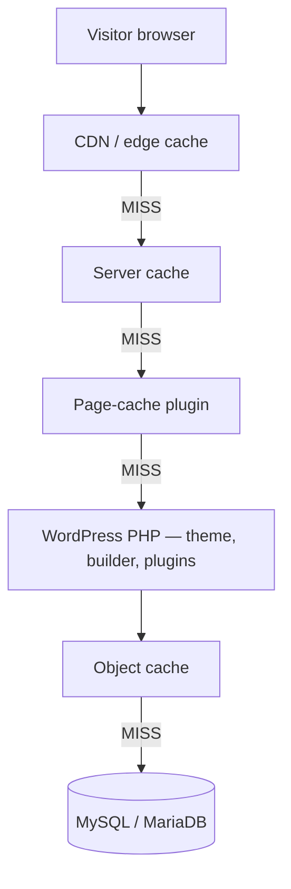
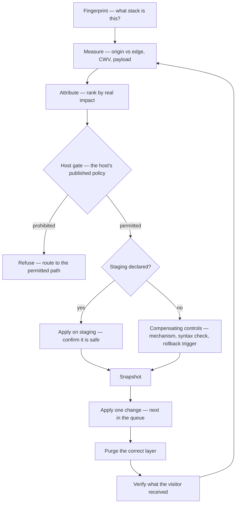

<!-- SPDX-License-Identifier: GPL-2.0-or-later -->
# wordpress-performance-skills

**Agent skills for auditing and fixing performance on live WordPress sites — across whatever stack the site actually runs on.**

Point an AI coding agent at a WordPress URL and get a ranked, evidence-backed performance audit.
Give it more access and it can fix what it found, safely, with a rollback for every change.

## Why this one

**It knows which hosts will delete your cache plugin.** Ask most tools why a WordPress site is
slow and sooner or later they suggest installing WP Rocket. On WP Engine, Kinsta, Pressable,
Flywheel, Bluehost and WordPress.com that advice is worse than useless — those hosts publish
disallowed-plugin lists and *remove* the plugin from your site. This one refuses the change,
against a table of all 17 host classes with a first-party citation per verdict, and routes you to
the host's own caching controls instead. A plan cannot talk its way past it.

**An unmeasured metric says so, with a reason.** Every report opens with the same ten rows — LCP,
INP, CLS, FCP, TBT, Speed Index, TTFB origin and edge, page weight, requests. When the session has
no browser, those rows read `unmeasured — no browser-capable tool in this session`, not silence and
never a guess. A reader can always tell "this is fine" from "nobody looked". A bundled checker
refuses a draft that breaks the format, so it holds even at the end of a long run.

**It separates origin from edge, and says which layer owns your problem.** A cached site with a
slow origin and a slow site are different problems with different fixes; a single blended number
hides which one you have.

**It says what it could not check.** Every report has a mandatory "What could not be checked" and
"What did not work" section. A report containing only wins is a sales document.

> **Status: v0.1, usable but young.** Both skills, the 20-entry defect catalog, the measurement
> scripts and the evaluation harness are in place. It has been exercised against live sites but
> not yet across the full stack matrix, so expect rough edges on stacks nobody has pointed it at.
> [Issues](https://github.com/billylui/wordpress-performance-skills/issues) about a stack it gets
> wrong are the most useful thing you can send.

## Install

### Any agent (recommended)

The [`skills` CLI](https://github.com/vercel-labs/skills) is the cross-agent installer and
supports 75+ agents. It **auto-detects the agent** it is running under and symlinks the skills
into that agent's own directory, so you do not need to know where your agent keeps them:

```bash
npx skills add billylui/wordpress-performance-skills
```

Useful flags:

| Flag | Effect |
|---|---|
| `-s wp-perf-audit` | Install only the read-only audit half |
| `-g` | Install globally (user-level) rather than into this project |
| `-a <agent>` | Target a specific agent; `-a '*'` installs to all detected agents |
| `-l` | List what the repo offers without installing |
| `--copy` | Copy the files instead of symlinking |

Verified against this repository: the installer reports `Found 2 skills` and lists both with
their descriptions.

### Claude Code

The `skills` CLI above works. If you prefer the plugin system, which also carries the
marketplace metadata:

```bash
/plugin marketplace add billylui/wordpress-performance-skills
/plugin install wordpress-performance@wordpress-performance-skills
```

### Manually

Copy `skills/wp-perf-audit/` and `skills/wp-perf-fix/` into wherever your agent looks for
skills — `.claude/skills/` for a Claude Code project, `.agents/skills/` for the cross-agent
convention, `~/.claude/skills/` or the equivalent for a global install. Paths differ per agent,
which is exactly what the `skills` CLI exists to handle.

**Install both.** `wp-perf-audit` is self-contained, but `wp-perf-fix` uses the audit skill's
`perf-probe.py` to measure before and after, and its `check_report.py` and report contract to write
the result — so it expects `wp-perf-audit` beside it. The `skills` CLI and the plugin install both
place them as siblings; a manual install should too.

### Requirements

Both skills declare these in their `compatibility` frontmatter, so a conforming agent can read
them before running anything:

- a shell, `curl`, and Python 3.9+ (standard library only — nothing to install)
- outbound network access to the WordPress site being audited

**A sandboxed runtime with no network access cannot perform this audit**, because it measures
live websites. Such a runtime should say so rather than report an unreachable site as a finding.

### Then point it at a site

> Audit the performance of https://example.com

No credentials, no plugin, no setup. That is tier 0, and it is a complete audit of the frontend
and cache layers. Install `wp-perf-audit` alone if you only want measurement and reporting — it
is read-only and touches nothing.

---

## Why this exists

The official [`WordPress/agent-skills`](https://github.com/WordPress/agent-skills) collection is
excellent, and you should install it. Its `wp-performance` skill is also, by its own frontmatter,
a **"backend-only agent"** that **"assumes the agent cannot use a browser UI"** — it profiles a
local checkout with WP-CLI and deliberately leaves frontend Core Web Vitals alone.

That leaves a real gap, and it is where most of the wins actually are.

This project generalizes a production campaign on a real multilingual WordPress site on managed
hosting, which moved mobile LCP from 16.3 s to 3.5 s and cut fleet page weight 38.6%. The
campaign's own conclusion:

> The two biggest wins were **configuration, not assets** — a 1.5 MB font nothing used, and an
> entrance animation holding the LCP text invisible. Neither would be found by looking at file sizes.

A backend-only, browser-blind, repo-oriented tool cannot find either one. That is the gap.

**This is a complement to the official skill, not a competitor.** Install both.

The full account of that engagement — including the target it missed and why — is in
[docs/case-study-anonymized.md](docs/case-study-anonymized.md).

### How this compares to other WordPress agent skills

Honest positioning, because picking the wrong tool wastes your time more than it wastes ours.

| | Covers | Best for | Not for |
|---|---|---|---|
| [`WordPress/agent-skills`](https://github.com/WordPress/agent-skills) `wp-performance` | WP-CLI `doctor`/`profile`, DB queries, autoload, object cache, cron | **Backend profiling of a local checkout.** The official, most widely used option. | Frontend Core Web Vitals — excluded by design; its frontmatter says "backend-only agent" |
| **wordpress-performance-skills** (this) | Core Web Vitals, origin-vs-edge TTFB, page-builder and theme config, cache layers, host constraints, guarded fixes | **A live site you operate**, at any access level including a bare URL | Deep query profiling — it routes you upstream instead |
| [`addyosmani/agent-skills`](https://github.com/addyosmani/agent-skills) | General web performance and browser debugging | Any web stack, excellent general practice | Anything WordPress-specific — no builder, plugin, or host awareness |

If you are profiling a plugin you are developing, use the official skill. If your live site is
slow and you want to know why, start here. They compose: this one hands off to that one by name
whenever a finding bottoms out in the backend.

---

## Which layer is your problem on?

This is the question that makes WordPress performance confusing, and the reason generic web-perf
advice so often misfires. A request can pass through three caching layers before any PHP runs — edge,
server, page-plugin — and two more inside the request, after it:



*A visitor request descends until something answers it. A cache HIT at the edge means the origin's
speed is irrelevant to that visitor — and a slow origin is still a real problem for everyone who
misses. They are different problems with different fixes, which is why this tool never reports a
single blended number.*

| Layer | Typical software | Defect classes that live here |
|---|---|---|
| **CDN / edge** | Cloudflare (+APO), QUIC.cloud, Bunny, KeyCDN, Fastly | HTML not cached at all, short TTLs, cookie-driven bypass, purge that never fires |
| **Server cache** | LiteSpeed, nginx `fastcgi_cache`, Varnish | disabled, bypassed for logged-out users, fighting a plugin cache |
| **Page-cache plugin** | WP Rocket, LiteSpeed Cache, W3TC, SG Optimizer | missing, misconfigured — or **banned by your host and quietly breaking things** |
| **WordPress PHP** | theme, page builder, plugins | render-blocking CSS/JS, unused preloads, LCP gated by an entrance animation, unresponsive images |
| **Object cache** | Redis, Memcached, APCu | absent, cold, or thrashing |
| **Database** | MySQL / MariaDB | autoload bloat, N+1 queries, missing indexes |

---

## Access tiers

The audit works with whatever access you have, and says plainly what it could not check. It never
claims a finding it has no way to establish.


*Each tier adds what the one before it could not see. Tier 0 needs no setup and no credentials at all.*

| Tier | You provide | It can measure | It can fix |
|---|---|---|---|
| **0 · Public** | a URL | Core Web Vitals, payload, render-blocking resources, origin-vs-edge TTFB, the full stack fingerprint | nothing — reports only |
| **1 · Admin** | + wp-admin / REST | + plugin and theme inventory, active caching stack | settings, plugin config, media |
| **2 · CLI** | + WP-CLI / SSH | + profiling, autoload bloat, slow queries, cron, object cache | + WP-CLI-driven config |
| **3 · Code** | + a deploy path | + theme and plugin source attribution | + code, staging-first where staging exists |

**Tier 0 is a complete, honest audit of any WordPress site with zero setup.** That is the point.

---

## How a session runs



*Fingerprint first, so every later step knows which stack it is standing on. Measure, attribute,
then gate: on managed hosts that ban caching plugins, "install WP Rocket" is not merely unhelpful
advice — hosts that publish a disallowed list remove such plugins, and the gate refuses it by
checking a cited policy table rather than trusting the plan.*

*Staging then shapes the process without deciding whether work happens. **Most WordPress sites have
no staging**, and a skill that refuses to work on them is unused rather than safe — so its absence
raises the evidence required instead of stopping the run. Staging proves a change is **safe**; it
cannot prove one is **faster**, because managed staging commonly runs with page cache and OPcache
switched off. The before/after measurement always happens on production, warm.*

*Every applied change gets a rollback snapshot, a purge on the layer that actually holds the stale
copy, and a verification against what a real visitor receives. A plan may queue several changes —
performance work has dependencies — but they execute strictly one at a time, and the plan has to say
why that order.*

---

## Stack coverage

Built stack-general from day one. The catalog is organized as **universal defect classes** with
per-stack detection and fix sections inlined, so supporting a new builder or host is a new section
rather than a rewrite.

- **Builders/editors** — Elementor, Block Editor, Site Editor/FSE, Divi, WPBakery, Bricks, Beaver
  Builder, Oxygen, Breakdance, Brizy, and classic themes with no builder at all
- **Hosting** — WP Engine, Kinsta, SiteGround, GoDaddy, Cloudways, Flywheel, Pressable, Hostinger,
  Pantheon, WP.com/VIP, shared cPanel, self-managed VPS
- **Caching** — WP Rocket, LiteSpeed Cache, W3TC, WP Super Cache, SG Optimizer, Breeze, Surge;
  nginx `fastcgi_cache`, Varnish; Redis, Memcached, APCu; Cloudflare APO, QUIC.cloud, Bunny, Fastly
- **Platform** — WooCommerce (HPOS), Multisite, WPML / Polylang / TranslatePress
- **Runtime** — **PHP 7.4 and MySQL 5.7 are first-class targets.** A large share of real WordPress
  sites still run exactly that, and a tool that assumes a modern runtime is wrong for most of them.

---

## No telemetry. Ever.

Skills execute shell commands, and Anthropic's own documentation warns that skills fetching data
from external URLs pose a real exfiltration risk. This tool gets pointed at production sites, so:

**No telemetry, no analytics, no phone-home, no version checks.** The only network destinations are
the site you point it at and hosts referenced by that site's own markup — plus any API endpoint you
supply yourself. A hardcoded third-party hostname fails CI.

The tradeoff is deliberate and worth naming: we have no usage analytics and never will. Adoption
gets measured by stars, forks, and issues like it's 2010.

---

## Repository layout

```text
skills/
  wp-perf-audit/          read-only, safe against production, the entry point
    SKILL.md
    references/
      catalog/            20 defect classes: frontend · caching · backend · platform · plugins
      access-tiers.md  measurement.md  stack-profiles.md  chrome-devtools-mcp.md
    scripts/
      fingerprint.py      what stack is this site running?
      perf-probe.py       origin-vs-edge TTFB, payload walk, before/after diffing
      capabilities.py     what can this audit honestly establish?
  wp-perf-fix/            the guarded write loop
    SKILL.md              plan → validate → approve → snapshot → apply → purge → verify
    references/
      host-constraints.md    the hard gate: what each host forbids
      risk-lanes.md  rollback.md  cache-purge-matrix.md  verify-live.md
    scripts/
      validate_plan.py    fail-closed gate; a non-zero exit stops the run
docs/
  CONTRACTS.md            JSON schemas and shared invariants every script obeys
  case-study-anonymized.md
evals/                    scenarios, seeded-defect fixtures, and the no-skill baseline
tools/                    CI checks: no-egress, link integrity, reference depth
```

Two skills, not one: the read/write split is a real safety boundary, and you can install only the
audit half.

## The fix loop

`wp-perf-fix` never acts unilaterally. Every change is one change, with approval, a snapshot
captured and verified first, a purge on the layer that actually holds the stale copy, and
verification of what a visitor really receives.

Before anything is touched, the intended change is written to disk as a plan and checked:

```bash
python3 skills/wp-perf-fix/scripts/validate_plan.py plan.json --stack stack.json
```

This is a **fail-closed gate, not a linter.** It refuses a plan whose page-cache change the host's
published policy prohibits, whose snapshot artifact does not exist, whose approval is not recorded,
whose purge layers do not match the layers actually detected, or whose access tier cannot perform
the change. The host verdict is computed from a cited table keyed by `host_class`, not read from the
plan — an unmapped host is refused rather than exempt, and an operator confirmation can unblock a
merely *unconfirmed* policy but never a published prohibition. Change kinds other than page-cache
plugins are still checked by the agent against the same reference. A non-zero exit stops the run. Prove it to yourself:

```bash
python3 skills/wp-perf-fix/scripts/validate_plan.py --selftest
```

---

## Contributing

The most useful contribution is **coverage of a stack this gets wrong** — see
[CONTRIBUTING.md](CONTRIBUTING.md). Reports that the audit misread a builder, host or cache layer
are worth more than feature requests, because no maintainer has seen every WordPress setup.

By participating you agree to the [Code of Conduct](CODE_OF_CONDUCT.md).

## License

Copyright © 2026 Billy Lui and contributors.

Licensed under [GPL-2.0-or-later](LICENSE) — matching the WordPress ecosystem norm, since this
project emits PHP destined for themes and plugins. This differs from the MIT choice made by
several other agent-skill collections; the reasoning is in [CONTRIBUTING.md](CONTRIBUTING.md).

This program is distributed in the hope that it will be useful, but **without any warranty**;
without even the implied warranty of merchantability or fitness for a particular purpose. It
changes production websites when you ask it to — read [SECURITY.md](SECURITY.md) for the safety
model, and keep your own backups.
