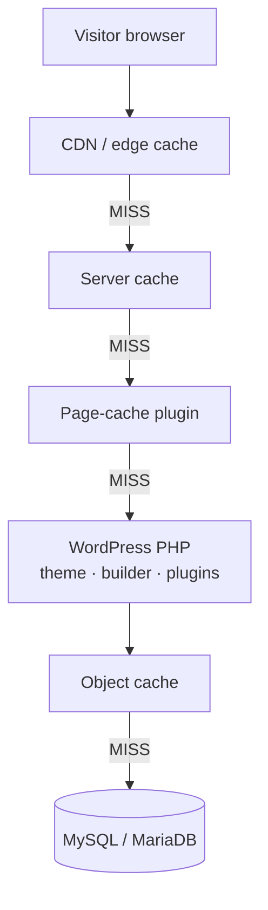
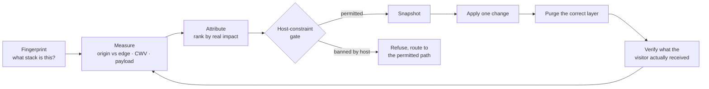

<!-- SPDX-License-Identifier: GPL-2.0-or-later -->
# wordpress-performance-skills

**Agent skills for auditing and fixing performance on live WordPress sites — across whatever stack the site actually runs on.**

Point an AI coding agent at a WordPress URL and get a ranked, evidence-backed performance audit.
Give it more access and it can fix what it found, safely, with a rollback for every change.

> **Status: early.** Phase 1 (measurement spine + stack fingerprinting + evaluation harness) is
> under construction. The skills themselves are not published yet. Watch the repo rather than
> depending on it.

---

## Why this exists

The official [`WordPress/agent-skills`](https://github.com/WordPress/agent-skills) collection is
excellent, and you should install it. Its `wp-performance` skill is also, by its own frontmatter,
a **"backend-only agent"** that **"assumes the agent cannot use a browser UI"** — it profiles a
local checkout with WP-CLI and deliberately leaves frontend Core Web Vitals alone.

That leaves a real gap, and it is where most of the wins actually are.

This project generalizes a production campaign on a real multilingual WordPress site on managed
hosting, which moved mobile LCP from 16.3 s to 3.5 s and cut fleet page weight 38.6%. The
campaign's own conclusion:

> The two biggest wins were **configuration, not assets** — a 1.5 MB font nothing used, and an
> entrance animation holding the LCP text invisible. Neither would be found by looking at file sizes.

A backend-only, browser-blind, repo-oriented tool cannot find either one. That is the gap.

**This is a complement to the official skill, not a competitor.** Install both.

---

## Which layer is your problem on?

This is the question that makes WordPress performance confusing, and the reason generic web-perf
advice so often misfires. A request passes through up to six caches before any PHP runs:



*A visitor request descends until something answers it. A cache HIT at the edge means the origin's
speed is irrelevant to that visitor — and a slow origin is still a real problem for everyone who
misses. They are different problems with different fixes, which is why this tool never reports a
single blended number.*

| Layer | Typical software | Defect classes that live here |
|---|---|---|
| **CDN / edge** | Cloudflare (+APO), QUIC.cloud, Bunny, KeyCDN, Fastly | HTML not cached at all, short TTLs, cookie-driven bypass, purge that never fires |
| **Server cache** | LiteSpeed, nginx `fastcgi_cache`, Varnish | disabled, bypassed for logged-out users, fighting a plugin cache |
| **Page-cache plugin** | WP Rocket, LiteSpeed Cache, W3TC, SG Optimizer | missing, misconfigured — or **banned by your host and quietly breaking things** |
| **WordPress PHP** | theme, page builder, plugins | render-blocking CSS/JS, unused preloads, LCP gated by an entrance animation, unresponsive images |
| **Object cache** | Redis, Memcached, APCu | absent, cold, or thrashing |
| **Database** | MySQL / MariaDB | autoload bloat, N+1 queries, missing indexes |

---

## Access tiers

The audit works with whatever access you have, and says plainly what it could not check. It never
claims a finding it has no way to establish.


*Each tier adds what the one before it could not see. Tier 0 needs no setup and no credentials at all.*

| Tier | You provide | It can measure | It can fix |
|---|---|---|---|
| **0 · Public** | a URL | Core Web Vitals, payload, render-blocking resources, origin-vs-edge TTFB, the full stack fingerprint | nothing — reports only |
| **1 · Admin** | + wp-admin / REST | + plugin and theme inventory, active caching stack | settings, plugin config, media |
| **2 · CLI** | + WP-CLI / SSH | + profiling, autoload bloat, slow queries, cron, object cache | + WP-CLI-driven config |
| **3 · Code** | + a deploy path | + theme and plugin source attribution | + code, staging-first |

**Tier 0 is a complete, honest audit of any WordPress site with zero setup.** That is the point.

---

## How a session runs



*Fingerprint first, so every later step knows which stack it is standing on. Measure, attribute,
then gate: on managed hosts that ban caching plugins, "install WP Rocket" is not merely unhelpful
advice — on WP Engine it risks suspension, and the gate refuses it. Every applied change gets a
rollback snapshot, a purge on the layer that actually holds the stale copy, and a verification
against what a real visitor receives. Then it measures again.*

---

## Stack coverage

Built stack-general from day one. The catalog is organized as **universal defect classes** with
per-stack detection and fix sections inlined, so supporting a new builder or host is a new section
rather than a rewrite.

- **Builders/editors** — Elementor, Block Editor, Site Editor/FSE, Divi, WPBakery, Bricks, Beaver
  Builder, Oxygen, Breakdance, Brizy, and classic themes with no builder at all
- **Hosting** — WP Engine, Kinsta, SiteGround, GoDaddy, Cloudways, Flywheel, Pressable, Hostinger,
  Pantheon, WP.com/VIP, shared cPanel, self-managed VPS
- **Caching** — WP Rocket, LiteSpeed Cache, W3TC, WP Super Cache, SG Optimizer, Breeze, Surge;
  nginx `fastcgi_cache`, Varnish; Redis, Memcached, APCu; Cloudflare APO, QUIC.cloud, Bunny, Fastly
- **Platform** — WooCommerce (HPOS), Multisite, WPML / Polylang / TranslatePress
- **Runtime** — **PHP 7.4 and MySQL 5.7 are first-class targets.** A large share of real WordPress
  sites still run exactly that, and a tool that assumes a modern runtime is wrong for most of them.

---

## No telemetry. Ever.

Skills execute shell commands, and Anthropic's own documentation warns that skills fetching data
from external URLs pose a real exfiltration risk. This tool gets pointed at production sites, so:

**No telemetry, no analytics, no phone-home, no version checks.** The only network destinations are
the site you point it at and hosts referenced by that site's own markup — plus any API endpoint you
supply yourself. A hardcoded third-party hostname fails CI.

The tradeoff is deliberate and worth naming: we have no usage analytics and never will. Adoption
gets measured by stars, forks, and issues like it's 2010.

---

## Repository layout

```text
skills/
  wp-perf-audit/          read-only, safe against production, the entry point
    SKILL.md
    references/
      catalog/            defect classes: frontend · caching · backend · platform · plugins
    scripts/
      fingerprint.py      what stack is this site running?
      perf-probe.py       origin-vs-edge TTFB, payload walk, before/after diffing
      capabilities.py     what can this audit honestly establish?
  wp-perf-fix/            the guarded write loop — snapshot, apply, purge, verify
docs/
  CONTRACTS.md            JSON schemas and shared invariants every script obeys
evals/                    scenarios, seeded-defect fixtures, and the no-skill baseline
```

Two skills, not one: the read/write split is a real safety boundary, and you can install only the
audit half.

---

## License

[GPL-2.0-or-later](LICENSE) — matching the WordPress ecosystem norm, since this project emits PHP
destined for themes and plugins.
