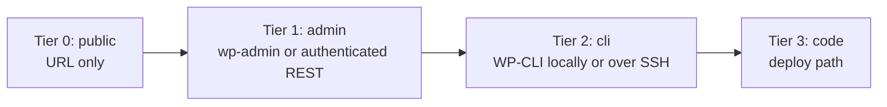

<!-- SPDX-License-Identifier: GPL-2.0-or-later -->
# Access tiers

Access tiers describe what the operator has actually made available, not what an auditor hopes
to receive. Use the highest confirmed tier, make only findings supported at that tier, and state
what remained outside the audit.

## Contents

- [The ladder](#the-ladder)
- [Tier 0: public](#tier-0-public)
- [Tier 1: admin](#tier-1-admin)
- [Tier 2: cli](#tier-2-cli)
- [Tier 3: code](#tier-3-code)
- [How to ask for the next tier](#how-to-ask-for-the-next-tier)
- [When the operator says no](#when-the-operator-says-no)
- [Capability reporting](#capability-reporting)
- [Report rule](#report-rule)

## The ladder

The diagram moves from a public URL through progressively stronger administrative, command-line,
and deployment access. Each tier includes the useful work below it; browser tooling is a separate
capability and does not rise automatically with WordPress access.

The closed tier names are `public`, `admin`, `cli`, and `code`. A configured credential, installed
binary, or claimed account does not by itself raise the tier. Confirm that the path works before
reporting it. An unauthenticated `/wp-json/` index is public evidence of WordPress, not proof of
`admin` access.

## Tier 0: public

**Access:** one public URL and no credentials.

Tier 0 is not a degraded audit. It is a complete, honest audit of the browser-visible frontend and
public cache layers. It is often enough to identify the mechanism that visitors experience and to
give the operator a prioritized change list.

### What becomes measurable

- Public stack signals from response headers, cookies, parsed class tokens, asset paths, and
  same-origin HTML. Run `fingerprint.py URL [--json PATH] [--quiet] [--pages N]`; `--pages N`
  permits N additional pages beyond the target.
- Origin-versus-edge TTFB, cache status, referenced request count, and measured payload buckets.
  Run `perf-probe.py --site URL [--repeats N] [--quick] [--json PATH]`.
- Render-blocking resource candidates visible in returned HTML and CSS.
- Lab LCP, CLS, and an interaction-based INP only when a browser-capable path is actually present;
  see [Chrome DevTools MCP](chrome-devtools-mcp.md).

### What becomes fixable

Nothing can be changed directly without authorization and a write path. The audit can still specify
the exact setting, asset, template, cache layer, expected metric movement, verification, and
rollback that an authorized operator should use. That is a useful fix plan, not a speculative fix.

### What remains invisible

- The authenticated plugin, theme, and active caching inventory.
- WordPress options, database queries, cron events, and object-cache statistics.
- Private theme or plugin source and deployment configuration.
- Whether a public marker hidden by a proxy exists behind the proxy. Keep the value `unknown` and
  name the higher-tier check that would settle it.

## Tier 1: admin

**Access:** working `wp-admin` access or an authenticated REST path with the needed permissions.

### What becomes measurable

- Active plugins and theme, relevant plugin settings, page templates, builder configuration, and
  the active caching stack exposed in WordPress administration.
- Whether a public inference maps to the configured component. For example, a `page-plugin` value
  of `unknown` at tier 0 can be checked against the active plugin list and its cache settings.
- Content-level causes such as an unnecessary preload, animation setting, or per-page builder
  option when the administration interface exposes them.

### What becomes fixable

Authorized, reversible administration changes become possible: toggle the specific setting, save
the previous value, purge only the required cache layers, warm the test URL, and re-measure. Before
any caching change, use the host-constraint table in the relevant catalog entry; an admin screen
does not make a host-prohibited plugin safe.

### What remains invisible

- Query timings, autoloaded option size, cron spikes, and object-cache hit rate without a CLI or
  equivalent observability path.
- Code paths that are not represented by an administration setting.
- Deploy behavior, untracked production changes, and source history.

`capabilities.py` deliberately does not attempt a login or read credentials. Its public REST probe
does not confirm this tier. Record tier 1 only after authenticated access has been exercised in the
current session by an authorized path.

## Tier 2: cli

**Access:** working WP-CLI against the intended WordPress installation, locally or over an
authorized SSH path.

### What becomes measurable

- The tier 1 inventory plus database, query, cron, autoload, and object-cache measurements.
- Exact option and plugin state in a form that can be captured before a change and compared after.
- Multisite state and site scope, which normally have no definitive public marker.

Use the official
[`WordPress/agent-skills` wp-performance skill](https://github.com/WordPress/agent-skills) for deep
backend profiling, including WP-CLI doctor/profile, database queries, autoload, object cache, and
cron. This project complements that backend path with live-site, browser-visible evidence; it does
not duplicate those procedures here.

### What becomes fixable

Authorized WP-CLI changes, carefully scoped database maintenance, and operational cache actions
become possible. Capture exact before state and a rollback command or artifact first. CLI access
does not waive the relevant catalog entry's host constraints.

### What remains invisible

- Private source-level causes when no readable checkout or deployment artifact is available.
- What a browser paints or which element becomes LCP unless a browser measurement path also exists.
- Whether an SSH client or environment variable actually grants remote access until it is exercised.

`capabilities.py` confirms `cli` only when `wp core version --skip-plugins --skip-themes` succeeds
against a local WordPress checkout. It does not use credentials or exercise SSH, so remote CLI may
need to be confirmed by the session and reported separately.

## Tier 3: code

**Access:** a deploy path through Git, rsync/SFTP, or a local checkout tied to the production
workflow.

### What becomes measurable

- Source attribution for theme and plugin behavior: the function, template, stylesheet, build
  output, or hook responsible for a browser-visible finding.
- Build and deployment assumptions, generated assets, and whether the editable source corresponds
  to what production serves.
- All lower-tier measurements when their access paths remain available.

### What becomes fixable

Authorized source changes can be prepared, validated, deployed through the operator's established
path, purged at the required layers, warmed, and measured. A local checkout alone is not permission
to deploy. Confirm the actual workflow and rollback artifact before changing production.

### What remains invisible

- Browser metrics when no browser-capable tool exists in the session.
- Field data for a page without enough real-user observations.
- External systems, proprietary edge configuration, or infrastructure not represented in the
  checkout or available control plane.

`capabilities.py` confirms `code` only for a writable local WordPress Git checkout with a
configured remote, and reports it at **`medium` confidence** for exactly that reason: its evidence
does not prove remote reachability or push credentials, does not establish that this remote is the
path that owns production, and does not exercise rsync/SFTP. The tier value says what kind of access
appears to exist; the confidence says how far it was actually proven. Treat any deploy path as
confirmed only after the authorized session exercises it.

## How to ask for the next tier

Ask only after tier 0 work has established why more access would change the answer. The request
should identify the uncertainty, the smallest access that resolves it, the read-only check to run,
and the useful result the operator will receive.

Use plain language for an operator who may not be a developer:

> The public audit shows two possible cache layers, but the public headers cannot distinguish
> them. If you are comfortable sharing temporary WordPress administrator access, I can check the
> active cache settings without changing them. If not, I will keep the layer as unknown and the
> frontend audit remains valid.

For CLI access:

> The remaining question is whether scheduled work is causing the TTFB variance. A read-only
> WP-CLI check can answer that. Your developer or host can run it and share the output; I do not
> need a permanent login. If that is not available, I will report cron attribution as unmeasured.

Good requests follow these rules:

1. Explain the concrete question, not a general desire for more access.
2. Ask for the least privilege and shortest duration that answers it.
3. Offer operator-run commands or redacted output when direct access is unnecessary.
4. State whether the check is read-only and obtain separate authorization before any change.
5. Make declining easy and explain exactly what the audit will still deliver.
6. Never ask for credentials in a report, command history, or other durable public artifact.

Do not imply that the audit is blocked merely because a higher tier would add certainty. Finish the
current tier first, then present the next tier as an optional way to resolve named unknowns.

## When the operator says no

Accept the boundary once. Do not repeat the request in different words. Continue with the strongest
evidence available and deliver:

- Reproducible public measurements, including raw samples and cache-layer separation.
- Findings limited to mechanisms visible at the confirmed tier.
- `unknown` for every unresolved stack value, with the exact next check that would settle it.
- A prioritized fix plan an authorized operator can execute, with host constraints, expected metric
  movement, verification, and rollback.
- A short list of unmeasured areas, separated from findings so absence of evidence is never read as
  a clean bill of health.

Never phrase a tier 0 result as "only a partial audit." It is a full audit of its declared scope.
The honest boundary makes it trustworthy.

## Capability reporting

Run `capabilities.py [--target URL] [--json PATH]`. The document's `tier` is the highest fully
confirmed tier. The `access` object records exercised paths; installed clients and configured
variables are not treated as access.

The `can_measure` and `cannot_measure` lists are designed to be copied into the audit boundary.
They are human-readable, mutually exclusive, and together describe what the session can and cannot
support. Preserve relevant `notes`, especially when a tool is installed but not exercised or when
Chrome DevTools MCP cannot be confirmed from the local process.

If the current session has separately exercised a capability that the local, credential-free script
cannot test, document that evidence explicitly. Do not silently promote the script's tier value.

## Report rule

Every report must state the confirmed tier, what was measured, and what could not be checked. Never
claim a finding above the confirmed tier. An unmeasured backend, browser metric, or deploy path is
not healthy, broken, zero, or absent; it is unmeasured.
