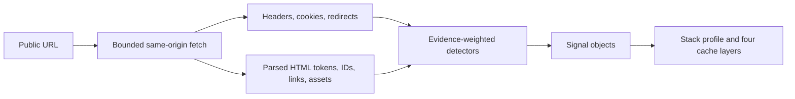

<!-- SPDX-License-Identifier: GPL-2.0-or-later -->
# Stack profiles

`fingerprint.py` turns public HTTP evidence into a conservative stack profile. Read the evidence
and confidence with every value; the profile is a set of supported claims, not a product-name
guessing engine.

## Contents

- [Run the fingerprint](#run-the-fingerprint)
- [Decision flow](#decision-flow)
- [The signal object](#the-signal-object)
- [Confidence rubric](#confidence-rubric)
- [How each profile field is decided](#how-each-profile-field-is-decided)
- [Cache layers](#cache-layers)
- [Honest limits and ambiguous signals](#honest-limits-and-ambiguous-signals)
- [Reading unknown correctly](#reading-unknown-correctly)
- [Mapping a profile to the catalog](#mapping-a-profile-to-the-catalog)

## Run the fingerprint

```text
python3 "$SKILL_DIR/scripts/fingerprint.py" URL [--json PATH] [--quiet] [--pages N]
```

The positional `URL` must be an absolute public HTTP or HTTPS URL. The probe performs read-only
GETs. It fetches the target and, when allowed, a bounded set of deterministic same-origin HTML
links discovered from the pages already fetched.

`--pages N` is the maximum number of **additional** pages, not the total. The target is always the
first page. Links with query strings are not crawled because they can encode logout, cart, or other
GET actions; administration, login, feed, and common non-HTML asset paths are also skipped.

`--json PATH` writes the machine-readable profile, with `-` meaning standard output. `--quiet`
suppresses the human report and emits JSON only. With neither option, the script prints a compact
human report.

## Decision flow


The diagram shows one public URL feeding a bounded fetch. Response metadata and parsed markup are
evaluated by field-specific detectors, which produce evidence-bearing signal objects and then the
fixed profile plus the four ordered cache-layer records.

The parser distinguishes structured evidence from raw response text. Class detection uses parsed
class tokens; meta generators, link relations, IDs, cookies, response headers, and asset paths have
their own evidence channels. That distinction prevents a CSS selector or script string from being
mistaken for a rendered element class.

## The signal object

Every non-trivial profile claim has this shape:

```json
{
  "value": "elementor",
  "confidence": "high",
  "evidence": [
    "html: builder element counts elementor=21; selected dominant elementor",
    "html: dominant builder has vendor-namespaced asset path /plugins/elementor/"
  ]
}
```

- `value` is a member of the field's closed vocabulary, or `unknown`. Boolean fields use `true`,
  `false`, or `unknown`.
- `confidence` is `high`, `medium`, `low`, or `none`.
- `evidence[]` contains short, checkable strings prefixed by a source such as `html:`, `header:`,
  `url:`, `cookie:`, or `probe:`.
- An empty `evidence[]` is valid only with `value: unknown` and `confidence: none`.

Read all three members together. A product name without its confidence and evidence is not the
finding the script produced.

## Confidence rubric

The rubric is fixed by `docs/CONTRACTS.md`:

| Confidence | Meaning | How to use it |
|---|---|---|
| `high` | A definitive signal that effectively nothing else can produce, such as a vendor-specific response header or vendor-namespaced asset path | Use as the identified value while retaining the evidence |
| `medium` | Two or more corroborating circumstantial signals, or one strong signal another product could in principle emit | Use with the stated qualification and check for conflicting evidence |
| `low` | One circumstantial signal | Treat as a hypothesis to confirm at a higher access tier |
| `none` | Nothing was found | Pairs only with `unknown`; do not convert it into a guess |

Confidence describes the evidence for that field, not the overall quality of the site or audit. A
profile can correctly contain `high` for `builder`, `low` for `theme_slug`, and `none` for
`host_class` at the same time.

## How each profile field is decided

The `profile` object always contains every fixed key. A consumer can index by key without testing
for absence.

### WordPress and published versions

`is_wordpress` looks for checkable public markers including `/wp-content/`, `/wp-includes/`, a
WordPress generator meta value, an RSD EditURI link, or a `wp-json` link. Finding those markers
produces `true` with evidence. Finding none produces `false` at `low` or `medium` depending on page
coverage; it does not prove that a heavily masked installation is not WordPress.

`wp_version` is populated only when a WordPress generator meta tag explicitly publishes a version.
Asset query strings and inferred compatibility are not used. Without that generator evidence, the
correct value is `unknown`.

### Builder

The builder detector counts parsed element class tokens for each supported family:
`elementor`, `divi`, `wpbakery`, `bricks`, `beaver-builder`, `oxygen`, `breakdance`, `brizy`,
`thrive`, `block-editor`, and `site-editor`. If WordPress is visible but none of those class
families is present, it reports `classic-none` at `low` confidence.

The token checks are exact prefixes or exact token names:

| `builder` value | Parsed class-token evidence |
|---|---|
| `elementor` | Prefix `elementor-` |
| `divi` | Prefix `et_pb_` |
| `wpbakery` | Prefix `wpb_` or exact token `vc_row` |
| `bricks` | Prefix `brxe-` |
| `beaver-builder` | Prefix `fl-node` or exact token `fl-builder` |
| `oxygen` | Prefix `oxy-` or exact token `ct-section` |
| `breakdance` | Prefix `breakdance-` |
| `brizy` | Prefix `brz-` |
| `thrive` | Prefix `thrv-` or `thrv_` |
| `block-editor` | Prefix `wp-block-` |
| `site-editor` | Prefix `wp-container-` or exact token `wp-site-blocks` |

A page can contain both a page builder and block-editor markup. The script does not pretend they
are mutually exclusive in the HTML. It selects the dominant family by element-token count, with a
deterministic name order for an exact tie. The evidence string lists every positive count and says
which value was selected. A matching vendor-namespaced asset path can raise the selected builder to
`high`; repeated element evidence without that path is `medium`, and a single circumstantial count
is `low`.

### Theme slug and theme type

`theme_slug` comes from `/wp-content/themes/<slug>/` asset paths. The most frequent slug is selected
deterministically, but the public asset path is still circumstantial, so confidence is `low` or
`medium`, not `high`.

`theme_type` uses the closed values `classic`, `block`, and `hybrid`. Parsed `wp-site-blocks` or
`wp-container-*` class tokens are block-template evidence. An explicitly named child-theme
stylesheet ID is classic evidence. Both kinds together produce `hybrid`; block markers alone
produce `block`; classic child evidence alone produces `classic`. Without those specific markers,
the script returns `unknown` rather than inferring the type from the theme slug.

### Server, PHP, and host class

`server` normalizes the public `Server` header to `nginx`, `apache`, `litespeed`,
`openlitespeed`, `cloudflare`, or `other`. An absent header produces `unknown`.

`php_version` requires an explicit `X-Powered-By` value that publishes `PHP/<version>`. No header,
or a header without a PHP version, produces `unknown`.

`host_class` uses vendor-namespaced headers for `high` confidence. A vendor label in the target
hostname is only `low` confidence because a hostname is circumstantial. When no supported public
marker exists, the value remains `unknown`; the detector does not infer a host from server
software, an IP address, or a generic cache header.

The `high` host checks are response-header names with these exact names or prefixes:

| `host_class` value | Header evidence |
|---|---|
| `wpengine` | `x-wpe-` |
| `kinsta` | `x-kinsta-` |
| `siteground` | `x-sg-` |
| `godaddy` | `x-gd-` |
| `cloudways` | `x-cw-` |
| `flywheel` | `x-fw-` |
| `pressable` | `x-pressable-` |
| `rocket-net` | `x-rocketcdn-` |
| `hostinger` | `x-hcdn-` |
| `bluehost` | `x-bluehost-` |
| `pantheon` | `x-pantheon-` or `x-styx-` |
| `wpvip` | `x-vip-` |
| `wpcom` | `x-nananana` |
| `shared-cpanel` | `x-cpanel-` |

The current public detector does not assign `self-managed` or `other` from generic evidence. Those
values remain `unknown` until a higher-tier check identifies them.

### CDN

`cdn` uses provider-specific headers and corroborating combinations. The exact public checks are:

| `cdn` value | Header evidence |
|---|---|
| `cloudflare-apo` | `cf-apo-via`, with `cf-cache-status` retained when present |
| `cloudflare` | `cf-cache-status` or a `Server` header identified as `cloudflare` |
| `quic-cloud` | `x-qc-cache` |
| `fastly` | `x-fastly-request-id`, or the corroborating combination `x-served-by` + `x-cache` + a `Via` value containing `Varnish` |
| `bunny` | `cdn-pullzone` or `cdn-uid` |
| `keycdn` | `x-edge-location` |
| `akamai` | `x-akamai-` or `akamai-grn` |
| `stackpath` | `x-sp-cache` or `x-hw` |
| `aws-cloudfront` | `x-amz-cf-` |

A generic `x-cache` header is not a provider identity. The current detector does not assign `none`
or `other` merely because the known headers are absent; it returns `unknown`.

Some combinations are deliberately below `high`. For example, multiple Fastly-like public
signals can support `medium`; a generic-looking edge-location signal used for `keycdn` remains
`low`. Read the actual evidence instead of promoting a familiar header name.

### Multilingual, WooCommerce, and multisite

`multilingual` checks public asset namespaces, parsed classes, response cookies, and other product
markers for `wpml`, `polylang`, `translatepress`, `weglot`, `gtranslate`, or
`multilingualpress`. A plugin asset path can support `high`; other corroborating markers support
`medium`. `hreflang` alone does not identify a plugin, so it leaves the value `unknown`. When no
supported product marker appears across sufficient page coverage, the value can be `none` with
`low` or `medium` evidence.

The exact product strings are `/plugins/sitepress-multilingual-cms/`, `wpml-`, or `_icl_` for
`wpml`; `/plugins/polylang/`, `polylang`, or `pll_` for `polylang`;
`/plugins/translatepress-multilingual/` or `trp-` for `translatepress`; `weglot` for `weglot`;
`gtranslate` or `gt_switcher` for `gtranslate`; and `multilingualpress` for
`multilingualpress`. The evidence prefix says whether the match came from HTML or a cookie.

`woocommerce` is `true` when WooCommerce class tokens, its vendor-namespaced plugin asset path, or
a `wc-ajax` endpoint reference appears. The asset path supports `high`; other public markers support
`medium`. No marker yields `false` at `low` or `medium` according to page coverage.

`multisite` remains `unknown` at tier 0 because WordPress multisite normally has no definitive
public marker. Confirm it at a higher tier instead of deriving it from URL shape.

## Cache layers

`cache_layers` always has exactly four entries in this order:

| `layer` | Public evidence considered | Example exact values |
|---|---|---|
| `edge` | The same provider evidence used for `cdn` | `cloudflare`, `cloudflare-apo`, `fastly`, `unknown` |
| `server` | `x-litespeed-cache`; `x-fastcgi-cache` or `x-cache-status`; `x-varnish` or `Via` containing `Varnish`; an HTML comment containing `generated by batcache` | `litespeed`, `nginx-fastcgi`, `varnish`, `batcache`, `unknown` |
| `page-plugin` | Plugin-specific HTML text, asset paths, or response headers | `wp-rocket`, `litespeed-cache`, `w3-total-cache`, `wp-super-cache`, `unknown` |
| `object` | `x-object-cache-pro`, `x-redis-cache`, `x-memcached`, or `x-apcu-cache` | `object-cache-pro`, `redis`, `memcached`, `apcu`, `unknown` |

Each entry repeats the signal members as `value`, `confidence`, and `evidence`. A layer that cannot
be observed publicly is still present with `value: unknown`, `confidence: none`, and an empty
evidence array. Fixed cardinality and ordering make profiles diffable.

Public cache-layer detection says what left a marker in the response. It is not a complete active
plugin inventory. Confirm ambiguous or hidden layers through `admin` or `cli` access.

For `page-plugin`, the header mappings are `x-litespeed-cache` → `litespeed-cache`,
`x-proxy-cache-info` → `sg-optimizer`, `x-wp-cf-super-cache` → `wp-fastest-cache`,
`x-breeze-cache` → `breeze`, `x-surge-cache` → `surge`, and `x-cache-enabler` →
`cache-enabler`. The exact lowercased HTML strings are `wp rocket` or `/plugins/wp-rocket/`;
`w3 total cache`; `wp-super-cache` or `wp super cache`; `wp fastest cache`; `sg optimizer` or
`siteground optimizer`; `breeze cache` or `/plugins/breeze/`; `surge cache`; and `cache enabler` or
`/plugins/cache-enabler/`. The evidence string records the marker that actually matched; do not
infer a plugin merely from the layer name.

## Honest limits and ambiguous signals

### Stripped headers

Managed hosts and proxies often strip identifying response headers. Therefore `php_version`,
`server`, and `host_class` are frequently `unknown` at tier 0. That is the correct answer, not a
fingerprint failure. The next checks are, respectively, the authenticated site-health/runtime
view, server configuration or host control plane, and an authenticated hosting or plugin inventory.

Do not turn an absent `X-Powered-By` into a PHP version guess. Do not turn `Server: nginx` into a
host identity: many stacks can emit it, and it may describe a proxy rather than the origin.

### Mixed builder markup

Page builders can render block-editor content inside their own containers, and different probed
pages can use different editors. Preserve the builder count evidence. If the dominant selection is
not sufficient for a page-specific recommendation, fingerprint the relevant page set and confirm
the template or editor at `admin` access.

### Parsed tokens versus raw text

Some marker strings appear inside CSS text without being element classes. A raw substring match is
not equivalent to a parsed class token. In particular, `wp-site-blocks` can appear in a CSS selector
on a classic site, and `global-styles-inline-css` is emitted in contexts that do not prove
`site-editor` or a `block` theme.

Do not loosen a parsed-token check into `if marker in html`. That change converts stylesheet text,
script data, and comments into false structural evidence. If a new detector needs CSS evidence,
name it as CSS evidence and give it a separate confidence rule.

### Generic cache headers

`x-cache` alone is ambiguous because more than one product emits it. It cannot justify `high`
confidence for `cdn`, `host_class`, or a cache product. The script records an explanatory note and
keeps the CDN `unknown` unless other provider-specific evidence settles it. The next check is a
corroborating namespaced header, DNS/control-plane evidence from an authorized source, or the
configured cache inventory at a higher tier.

### Public absence is not configured absence

A plugin can remove generator tags, combine assets, rename paths, or serve a fully cached document
that contains no identifying marker. A negative public probe describes the probed responses. It
does not prove an invisible plugin, host feature, or cache layer is absent unless the field's
evidence model explicitly supports a negative value.

## Reading unknown correctly

When a value is `unknown`, read `notes` for the reason. Useful notes distinguish:

- a header that is absent or stripped;
- a marker that is present but vendor-ambiguous;
- insufficient public evidence for a theme type or product;
- a bounded page that was truncated;
- a same-origin page that failed or returned non-HTML content;
- a property, such as multisite, with no definitive tier 0 marker.

Report the reason and the next check. Do not replace `unknown` with the most common product, a host
suggested by branding, or a value copied from another site on the same account.

## Mapping a profile to the catalog

The vocabulary strings in the profile are the exact strings used in each catalog entry's per-stack
table. Map by exact equality:

1. Read the relevant signal's `value`, `confidence`, and `evidence`.
2. Use the catalog row whose identifier exactly equals that `value`, such as `elementor`,
   `wpengine`, `cloudflare-apo`, `wp-rocket`, or `wpml`.
3. Apply the row only at the confidence level and access tier its detection supports.
4. If the value is `unknown`, use the generic detection and state the higher-tier check; do not
   choose the nearest-looking row.
5. For a fix, follow the catalog entry's host-constraint table using the exact `host_class` value.

Prose may say “WP Engine” or “WP Rocket” for readability, but identifiers used for matching must
remain `wpengine` and `wp-rocket`. An identifier mismatch silently selects the wrong stack guidance.
